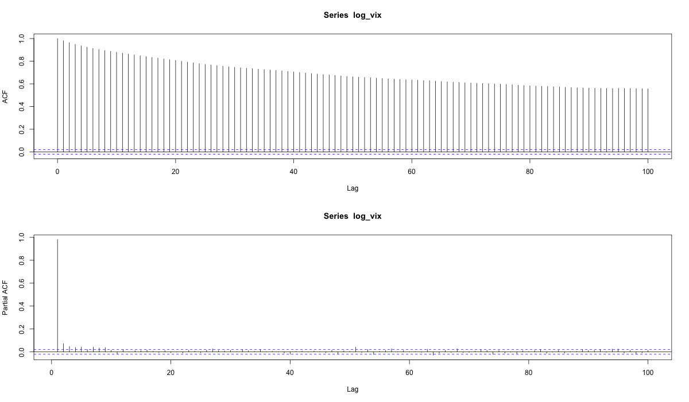
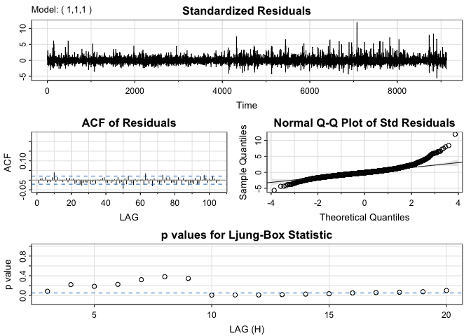
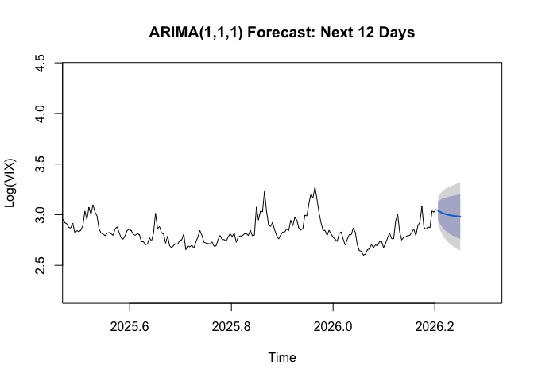
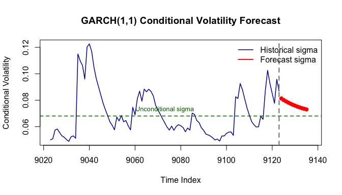

## Outline {.smaller}

::: {.columns}
::: {.column width="50%"}

### Part 1: Introduction
- Motivation & Background
- VIX: The "Fear Index"
- Research Objectives

### Part 2: Data & Methods
- Dataset Overview
- Box-Jenkins SARIMA
- GARCH Models
:::

::: {.column width="50%"}

### Part 3: Results
- ARIMA(1,1,1) Findings
- GARCH(1,1) Estimation
- Volatility Persistence

### Part 4: Conclusion
- Key Discoveries
- Practical Applications
- Future Research
:::
:::

# Introduction

## Why Study VIX?

::: {.info}
**VIX = CBOE Volatility Index**  
Market's expectation of 30-day forward volatility from S&P 500 options
:::

- **Trading**: Options pricing, portfolio hedging
- **Risk Management**: VaR calculations, stress testing  
- **Market Sentiment**: "Fear gauge" during crises
- **Asset Allocation**: Inverse correlation with stocks

## Challenges 

**Volatility exhibits complex patterns:**

- Clustering (high volatility follows high volatility)
- Mean reversion (returns to long-run average)
- Heavy tails (extreme events more common than normal distribution)

These are known as **stylized facts** which makes forecasting and generating synthetic financial time series a hard task.

## VIX Time Series (1990-2026)

```{r vix-plot, echo=FALSE, fig.width=14, fig.height=6}
library(readr)
library(ggplot2)

vix_data <- read_csv("../Data/VIXCLS.csv", show_col_types = FALSE)
vix_data <- na.omit(vix_data)

ggplot(vix_data, aes(x = observation_date, y = VIXCLS)) +
  geom_line(color = "#003660", linewidth = 0.5) +
  geom_hline(yintercept = mean(vix_data$VIXCLS), 
             color = "#FEBC11", linetype = "dashed", linewidth = 1) +
  annotate("rect", xmin = as.Date("2008-01-01"), xmax = as.Date("2009-01-01"),
           ymin = 0, ymax = Inf, alpha = 0.2, fill = "red") +
  annotate("rect", xmin = as.Date("2020-01-01"), xmax = as.Date("2021-01-01"),
           ymin = 0, ymax = Inf, alpha = 0.2, fill = "red") +
  annotate("text", x = as.Date("2008-06-01"), y = 75, 
           label = "2008\nCrisis", size = 4) +
  annotate("text", x = as.Date("2020-06-01"), y = 75, 
           label = "COVID-19", size = 4) +
  labs(title = "CBOE Volatility Index (VIX): 1990-2026",
       x = "Year", y = "VIX Level") +
  theme_bw()+
  theme(plot.title = element_text(color = "#003660", face = "bold"))
```
**Key Features:** Volatility clustering, crisis spikes, mean reversion

## Research Objectives

**Primary Goal:** Model VIX dynamics using time series analysis methods and use those models to forecast

1. Identify appropriate SARIMA model for conditional mean
   - Apply Box-Jenkins methodology

2. Capture time-varying volatility with GARCH
   - Test for ARCH effects

3. Forecast future VIX levels and volatility using both models

**Key Result:** Comprehensive analysis combining SARIMA + GARCH with long memory investigation

# Data & Methodology

## Data Overview

**Source:** The dataset is obtained from the [FRED: Federal Reserve Bank of St. Louis.](https://fred.stlouisfed.org/series/VIXCLS). The source is Chicago Board of Options Exchange and released by CBOE Market Statistics.

**Period & Frequency:** January 2, 1990 – February 16, 2026

**Frequency:** Daily (252 trading days/year)  

**Observations:** 9,124 (after removing NAs)

```{r summary-stats, echo=FALSE}
library(knitr)
library(kableExtra)

summary_stats <- data.frame(
  Statistic = c("Mean", "Median", "Std. Dev.", "Min", "Max"),
  Value = c(19.44, 17.58, 7.77, 9.14, 82.69)
)

kable(summary_stats, align = c('l', 'r'),
      caption = "VIX Summary Statistics") %>%
  kable_styling(font_size = 24)
```

## Box-Jenkins SARIMA

It is a simple step-by-step approach in order to choose the best SARIMA model.

::: {.columns}
::: {.column width="50%"}
**1. Identification**

- Transform data (log stabilizes variance)
- Test stationarity (ADF test)
- Examine ACF/PACF patterns
- Determine orders (p, d, q)

**2. Estimation**

- Maximum likelihood estimation
- Compare candidate models (AIC/BIC)
:::

::: {.column width="50%"}
**3. Diagnostic Checking**

- Residual analysis (ACF)
- Ljung-Box test (white noise?)
- Q-Q plots (normality?)
- Check for remaining patterns

**4. Forecasting**

- Generate h-step ahead forecasts
- Compute confidence intervals
:::
:::

## GARCH Methodology

:::: {.columns}
::: {.column width="55%"}
**GARCH(1,1) Specification:**

**Mean equation:**
$$r_t = \mu + \epsilon_t, \quad \epsilon_t = \sigma_t z_t$$

**Variance equation:**
$$\sigma_t^2 = \omega + \alpha_1 \epsilon_{t-1}^2 + \beta_1 \sigma_{t-1}^2$$

where:

- $\omega$ = constant
- $\alpha_1$ = ARCH effect (shocks)
- $\beta_1$ = GARCH effect (persistence)
:::

::: {.column width="45%"}
**Key Properties:**

- **Stationarity**: $\alpha + \beta < 1$
- **Persistence**: $\alpha + \beta$ measures volatility persistence
- **Half-life**: $\frac{\ln(0.5)}{ \ln(\alpha + \beta)}$

:::
::::


# Results: SARIMA

## Stationarity Testing
```{r adf-table, echo=FALSE}
adf_results <- data.frame(
  Series = c("Log(VIX)", "Δ Log(VIX)"),
  `ADF Statistic` = c(-6.10, -23.48),
  `P-value` = c(0.01, 0.01),
  Conclusion = c("Stationary", "Stationary")
)

kable(adf_results, align = c('l', 'r', 'r', 'c'),
      caption = "Augmented Dickey-Fuller Test Results") %>%
  kable_styling(font_size = 28)
```

**Paradox:** ADF says stationary (d=0), but ACF shows extremely slow decay (suggests d=1)

**Resolution:** VIX exhibits **long memory** (fractional integration)

- True $d \approx 0.4$ (between I(0) and I(1))
- **Decision:** Use $d=1$ 
- ARIMA(1,1,1) provides practical approximation

The long memory segment using $d=0.4$ is done in my [github repo](https://github.com/aarti-garaye/VIXTimeSeriesAnalysis.git)

## ACF/PACF Analysis

:::: {.columns}
::: {.column width="70%"}
{width=100%}

<div class="caption">ACF shows slow decay (long memory), PACF cuts off at lag 1</div>
:::

::: {.column width="30%"}

**Interpretation:**

- **ACF**: Very slow decay (persists 400+ lags)
  - Charaacterstic of fractional integration
  
- **PACF**: Cuts off after lag 1
  - Suggests AR(1) component
  
:::
::::

## Model Selection

```{r model-comparison, echo=FALSE}
model_comp <- data.frame(
  Model = c("ARIMA(0,1,1)", "ARIMA(1,1,0)", "ARIMA(1,1,1)", "ARIMA(2,1,1)", "ARIMA(1,1,2)"),
  AIC = c(-23240.51, -23232.92, -23364.86, -23362.12, -23361.45),
  BIC = c(-23226.27, -23218.68, -23343.51, -23333.66, -23332.99),
  Best = c("", "", "✓", "", "")
)

kable(model_comp, align = c('l', 'r', 'r', 'c'),
      caption = "Model Comparison (✓ = Best)") %>%
  kable_styling(font_size = 26)
```

ARIMA(1,1,1) has the lowest AIC BIC

## SARIMA Fit

:::: {.columns}
::: {.column width="70%"}
{width=120%}

:::

::: {.column width="30%"}

**Standardized Residuals**: No obvious patterns or trends; appear to fluctuate around zero

**ACF of Residuals**: Most lags are within confidence bounds, suggesting white noise for residuals

**Q-Q Plot**: Shows some deviation in the tails

**Ljung-Box Statistics**: Many p-values are below 0.05, suggesting some remaining autocorrelation

:::
::::

## GARCH Models

We must test for conditional heteroskedasticity, the ARCH test results show that GARCH(1,1) is justified

```{r arch-test, echo=FALSE}
arch_results <- data.frame(
  Statistic = c("Chi-squared", "Degrees of Freedom", "P-value", "Conclusion"),
  Value = c("412.10", "12", "< 2.2e-16", "ARCH effects present")
)

kable(arch_results, align = c('l', 'c'),
      caption = "ARCH-LM Test Results") %>%
  kable_styling(font_size = 28)
```

::: {.alert}
**Highly significant** (p < 0.001) Confirms volatility clustering!  
Justifies GARCH modeling
:::

## Key GARCH Findings {.smaller}

:::: {.columns}
::: {.column width="50%"}
**1. Volatility Persistence**

$$\alpha_1 + \beta_1 = 0.91$$

- Very high persistence (91% carries over daily)
- Half-life = 7.4 days (shocks last 1-2 weeks)

**2. ARCH vs GARCH**

- $\beta_1$ (0.776) >> $\alpha_1$ (0.134)
- **Past volatility > recent shocks**
- Volatility regimes more important than individual events
:::

::: {.column width="50%"}
**3. Heavy Tails**

- Student-t degree of freedom $\nu = 4.72$
- Extremely fat tails (kurtosis ≈ 9 vs 3 for normal)
- Normal distribution severely underestimates tail risk

**4. Model Fit**

- Log-Likelihood: 12,806.70
- AIC/BIC ≈ -2.80
- Substantially better than ARIMA-only
:::
::::

::: {.info}
**Bottom line:** VIX volatility is highly persistent, regime-driven, and heavy-tailed
:::


# Results

## ARIMA(1,1,1) Forecasting
:::: {.columns}
::: {.column width="50%"}
{width=100%}
:::


::: {.column width="50%"}
**Key Observations:**

- Mean reversion to long-run average (log(VIX) ≈ 3.0)
- Expanding confidence intervals (increasing uncertainty)
- Cannot predict crises or regime changes
- Useful for short-term (1-2 weeks) under normal conditions
:::
::::

## GARCH Forecast

:::: {.columns}
::: {.column width="50%"}
{width=100%}

:::
::: {.column width="50%"}
**Key Observations:**

- Gradual mean reversion to unconditional volatility
- Half-life effect visible (7.4 days)
- Cannot predict regime changes or crises
- Useful for VaR calculations and options pricing
:::
::::

# Conclusion

## Key Discoveries

::: {.columns}
::: {.column width="50%"}
**1. Long Memory**

- VIX exhibits fractional integration (d ≈ 0.4)
- Explains extremely slow ACF decay

**2. ARIMA(1,1,1)**

- Best balance of fit and parsimony
- Captures mean dynamics effectively
- Near-cancellation (AR ≈ -MA) confirms long memory
:::

::: {.column width="50%"}
**3. GARCH(1,1)**

- High persistence ($\alpha + \beta = 0.91$)
- Half-life = 7.4 days

**4. Model Complementarity**

- ARIMA: mean dynamics
- GARCH: volatility clustering
:::
:::

---

## Thank You! {.center}

<br>

**Aarti Garaye**  
aartigaraye@ucsb.edu

**PSTAT 174 - Time Series Analysis**  
Professor Tomoyuki Ichiba

<br>

::: {.small}
**Code & Analysis:** [Available on GitHub](https://github.com/aarti-garaye/VIXTimeSeriesAnalysis.git)  
**Data Source:** FRED (Federal Reserve Bank of St. Louis)
:::
